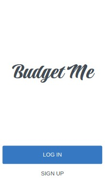

# Budget App

The Budget App is a mobile web application where you can manage your budget, you have a list of transactions associated with a category, so that you can see how much money you spent and on what.



## Built With

- 

## Live Demo

[Demo Available Here](https://sheltered-escarpment-74586.herokuapp.com/)

### Installation

1. Clone the repo https://github.com/Richie9000/budget-app.git

### Usage

1. Install ruby gems dependencies

   ```sh
   bundle install
   ```

2. Install node dependencies

   ```sh
   npm install
   ```

3. Database creation

   ```
   rails db:setup
   ```

4. Run the web server

   ```sh
   rails server
   ```

5. Access to the website in a browser with the following link

   ```sh
   localhost:3000
   ```

### Test

1. For testing run:

   ```sh
   rspec
   ```

## Acknowledgements

Gregoire Vella on Behance, the author of the original design, as required by the Creative Commons License.

## Author

👤 **Ricardo R**

- GitHub: [@Richie9000](https://github.com/Richie9000)
- LinkedIn: [LinkedIn](https://linkedin.com/in/ricardo_rodr)

## 🤝 Contributing

Contributions, issues, and feature requests are welcome!

Feel free to check the [issues page](https://github.com/the-catalystmc/recipe-app/issues).

## 📝 License

This project is [MIT](https://github.com/git/git-scm.com/blob/main/MIT-LICENSE.txt) licensed.
